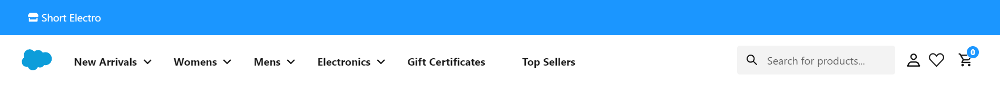
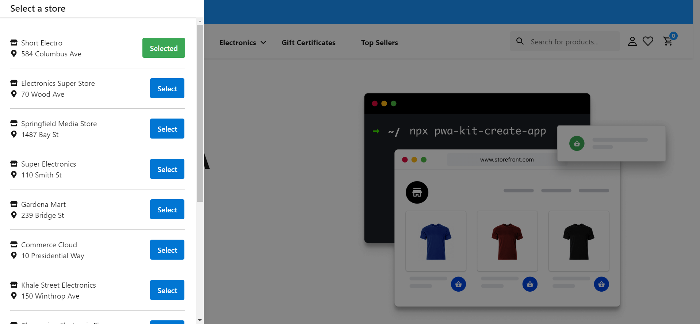
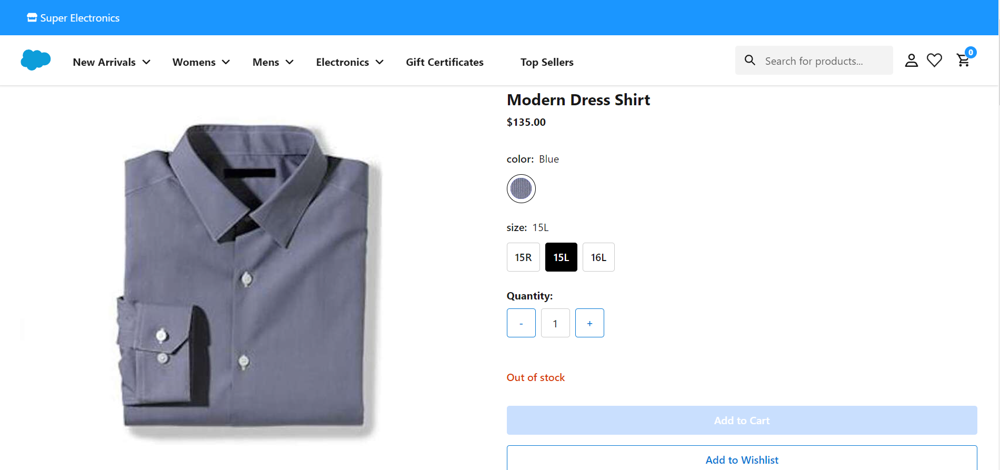
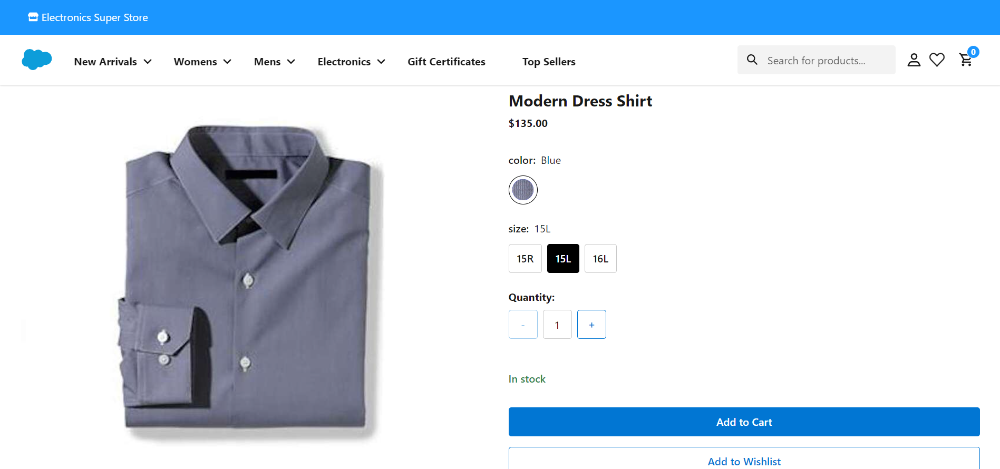
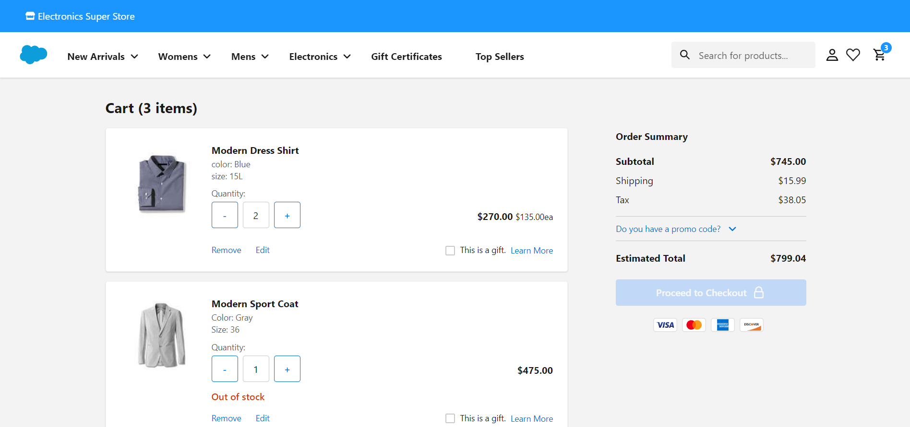
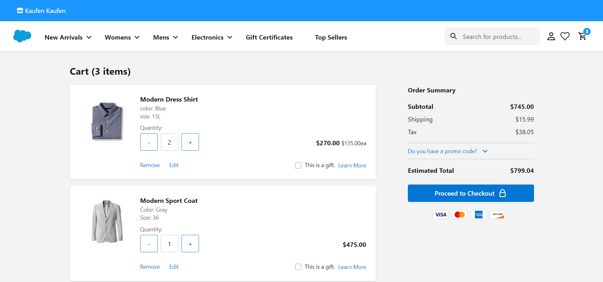

# Salesforce Commerce Cloud (SFCC) Geolocated Inventory for PWA Kit

SFCC Geolocated Inventory for PWA Kit is a package that implements the feature of inventory based on geolocated stores to Salesforce Commerce Cloud Composable Storefront. 

## Prerequisites

1. SFCC Geolocated Inventory for PWA Kit is designed to work with Salesforce PWA Kit, so in order to use this package you will need to create a local project using the React Retail App template. This package have been tested with PWA Kit version 2.7.2, so this is the version you should install. Run the following command to create a new project:

	```shell
	npx pwa-kit-create-app@2.7.2
	```
	For more information regarding the creation and usage of the React Retail App refer to the [Salesforce Developer documentation page](https://developer.salesforce.com/docs/commerce/pwa-kit-managed-runtime/guide/getting-started.html)

2. After installing the PWA Kit, please modify the *package.json* file and add the following dependency:
    
    ```json
    "dependencies": {
        "react-icons": "^4.10.1"
    }
	```
    After that, run the *npm i* command in order to install the new dependency

3. SFCC Geolocated Inventory for PWA Kit has some features that require session bridging to be enabled. In order to do this, a series of steps need to be followed:

    3.1. First, you need to set up SLAS for your PWA Kit application. For this step, please follow the instructions in the Salesforce [Set Up API Access](https://developer.salesforce.com/docs/commerce/pwa-kit-managed-runtime/guide/setting-up-api-access.html) guide

    3.2. The *plugin_slas* cartridge needs to be installed in your own sandbox. All the instalation instructions and configurations post-installation are specified in the [README](https://github.com/SalesforceCommerceCloud/plugin_slas) of the *plugin_slas* repository

    3.3. After installing the *plugin_slas* cartridge you will need to modify *commerce-api/auth.js* file in your PWA Kit application. First, you need to enable the CookieStorage, to do this go to line 53 of the *auth.js* file in which you should find a comment that talks about storing tokens as cookies. **Uncomment** the code in line 55 and **comment** the code in line 56 and save the document. The following [link](https://github.com/SalesforceCommerceCloud/pwa-kit/blob/release-2.7.x/packages/template-retail-react-app/app/commerce-api/auth.js#L53-L56) should take you to the PWA Kit repository and highlight the piece of code that requires modification

    3.4. Finally, you will need to modify another line in *commerce-api/auth.js* file. Go to line 259 and **uncomment** that line of code

    3.5. Save all changes in *commerce-api/auth.js* file

    3.6. After following all these steps, session bridging should be enabled and functional

    **Note:** If you require more details on the session bridging, you can refer to the Salesforce Phased Headless Rollouts [documentation guide](https://developer.salesforce.com/docs/commerce/pwa-kit-managed-runtime/guide/phased-headless-rollouts.html)

4. SFCC Geolocated Inventory for PWA Kit requires that you set and properly configure an Account Manager Client ID. In order to do this, go through the following steps:

    4.1. Go to your Account Manager [account](https://account.demandware.com/dw/account/Home) and in the **API Client** section click on the **Add API Client** button. Please, make sure that you have the permissions to perform these actions, if not contact your account administrator

    4.2. Once you are in the API Client creation view, provide a name an a password to your client ID (make sure you do not forget this password), and associate the client ID with your organization in *Organizations* field

    4.3. In the *Default Scopes* field put the following values: *mail, roles, tenantFilter, profile, openId*. The values for this field are not comma separated, they MUST be entered in a column distribution, this is one under the other

    4.4. In the *Allowed Scopes* field put the following values: *sfcc.shopper-baskets-orders.rw, sfcc.shopper-myaccount.baskets, sfcc.shopper-baskets-orders, sfcc.shopper-categories, sfcc.shopper-customers.login, sfcc.shopper-customers.register, sfcc.shopper-gift-certificates, sfcc.shopper-myaccount.rw, sfcc.shopper-product-search, sfcc.shopper-productlists, sfcc.shopper-products, sfcc.shopper-promotions, sfcc.shopper-stores, sfcc.shopper-myaccount.baskets.rw, sfcc.catalogs, sfcc.customerlists.rw*. Just like the values in *Default Scopes*, you must enter them one under the other in a column distribution

    4.5. In the *Token Endpoint Auth Method* select **private_key_jwt** and make sure the field *Access Token Format* has the value **JWT**. Then click on Save and your client ID should be created

    4.6. Once the client ID is created go to your sandbox and under *Administration > Site Development > Open Commerce API Settings*, select the type **Shop** and grant access to all endpoints for your AM Client ID using the JSON format specified in this [file](./AmClientIdSettingsFormat.json). Save your changes and your AM Client ID should be good to be used in SFCC Geolocated Inventory package

## Installation

**Note:** The installation steps described in this section are **ONLY** valid for a fresh installation of the PWA Kit, if you need to integrate this package with your custom PWA Kit project, contact the Appspring support team in order to get specific instructions on how to achieve this.

SFCC Geolocated Inventory for PWA Kit package offers two things: the modifications for PWA Kit and SFRA controllers.

1. The PWA Kit modifications are provided in a folder structure identical to the PWA Kit, which contain new React components and several modifications to PWA Kit's original files. In order to install this, go to the *sfcc-geolocated-inventory-integration* folder copy the *app* folder and paste it in the root of your PWA Kit project. By doing this, you will replace the existing files with the ones provided by the integration package

2. After copying the files into your PWA Kit project, go to *config/default.js* and add a the following entry in *proxyConfigs*:

     ```javascript
    {
        host: '<Your-Realm-ID>.dx.commercecloud.salesforce.com',
        path: 'controller'
    }
	```
    This new proxy configuration is needed for the calls to the SFRA controller that the package provides.

3. Go to *app/contexts/index.js* and in the line 236 replace '<Your-AM-Client-ID>' with the actual value of your Account Manager Client ID

4. SFRA controllers are also needed for the integration package to work. The controllers are inside *sfra-cartridges/apps_user_geolocation* path. For all the details on how to install *apps_user_geolocation*, please refer to the [cartridge README](./sfra-cartridges/README.md)

## Usage

SFCC Geolocated Inventory for PWA Kit package unlocks the ability to select a store based on the users geolocation and allowing them to buy products on that specific store. 

The usual behavior of the PWA Kit headless storefront is having all the offered products tied to a single inventory list (the inventory list marked as active in the sandbox) and, whenever an user buys the product, the stock level is reduced in that inventory list. SFCC Geolocated Inventory for PWA Kit package modifies this behavior in order to provide more flexibility to both the customer and the seller.

The Business Manager allows to create multiple stores and configure their location (latitude, longitude) and associate them with an inventory list. SFCC Geolocated Inventory for PWA Kit takes advantage of this and when the user enters the storefront, a list of stores are queried based on the geolocation of the user and the closest store is selected automatically. The name of the selected store can be seen in the header of the storefront page and by clicking the name of the store, a drawer with the list of stores is displayed.





Even though the closest store is automatically selected by the application, the users can choose any store they want by clicking the select button next to the name of each store. If the user is guest, the selection will be saved in the browser. If the user is registered, the selection will be saved in the session of the user thus, the user will be able to access the selection everytime they login no matter the browser.

Once the new store is selected, the user can navigate to the Product List Page and select any product of their choosing and when they enter the Product Detail Page (PDP), the stock information that is shown for this product will be related to the selected store. The store selection can be changed anywhere in the site and this includes the PDP, when the user changes the store while in the PDP, the stock information for the product is refreshed and will show availability for the newly selected store. When selecting product variations and quantity, the user can see 'In stock', 'Only x left' and 'Out of stock' messages.

For example, the user can be navigating a product in a store that has stock, but if they decide to change the store to another one that does not have stock for this particular product, since the availability information is refreshed, the application will immediately show an 'Out of stock' message.

When no stock is available the 'Add to Cart' button is disabled and the user will not be able to add that particular product to cart. If the user switches to a store that has stock for that product, the button will be enabled again allowing the user to add the product to the cart.





As mentioned before, the store selection feature is available anywhere in the site and the user can change the store in the cart page too. When the user changes the store while in the cart page, the stock information will be updated and validations will be triggered in order to check if the product is available in the newly selected store. If the new store does not have stock for the product, an 'Out of Stock' message will be displayed and the 'Proceed to Checkout' button will be disabled. The checkout button is disabled if products are out of stock or if the quantity exceeds the stock availability in the selected store. Checkout button will only be active when all the products in cart are in stock. Everytime the user changes the store while products are in the cart, their stock information gets updated.





Once the user proceeds to checkout and completes the purchase, the order will be created and stock level for each of the purchased products will be decreased in the inventory list related to the selected store.

Please refer to this [link](https://www.youtube.com/watch?v=-DXh3-ebCKI&ab_channel=AppspringDevelopmentInc) in which you will find a video that shows all the features of the package already implemented in the Salesforce Commerce Cloud Composable Storefront.